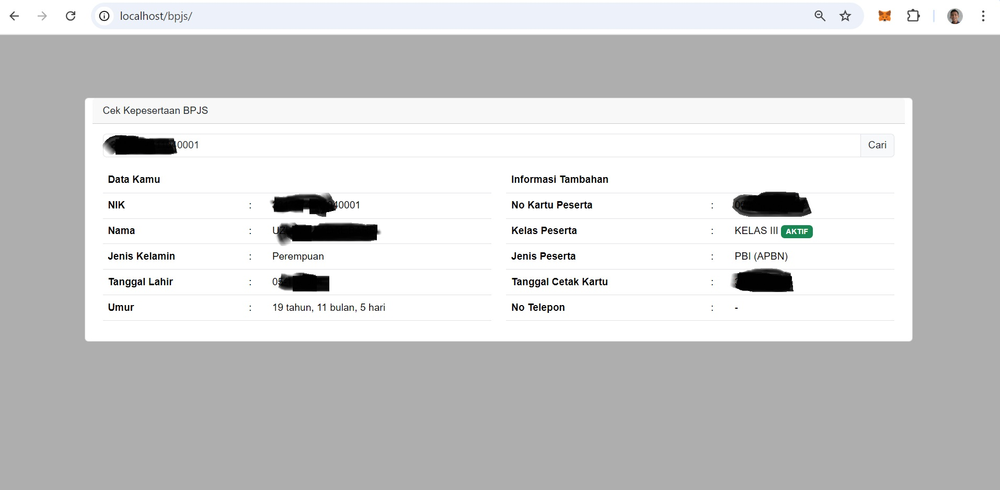

# Cek Peserta BPJS
## Tangkapan Layar

Berikut adalah beberapa tangkapan layar dari aplikasi:


*Gambar 1: Halaman utama aplikasi*

## Deskripsi

Aplikasi ini adalah sebuah alat bantu untuk memeriksa status peserta BPJS. Dengan menggunakan API BPJS, aplikasi ini dapat memeriksa status peserta berdasarkan nomor kartu atau NIK.

## Cara Penggunaan


1. Clone atau download repository ini.
2. Instal dependensi menggunakan Composer:
   ```bash
   composer install
   ```
3. Konfigurasi file `authApi.php` dengan menggunakan key yang sudah di dapat dari BPJS.
4. Jalankan server lokal:
   ```bash  
   php -S localhost:8000
   ```
5. Buka browser dan akses `http://localhost:8000`.

## Kontribusi

Kontribusi untuk proyek ini dapat dilakukan melalui GitHub. Silakan fork repository ini dan buatkan pull request untuk setiap perubahan yang ingin Anda lakukan.    

